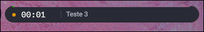
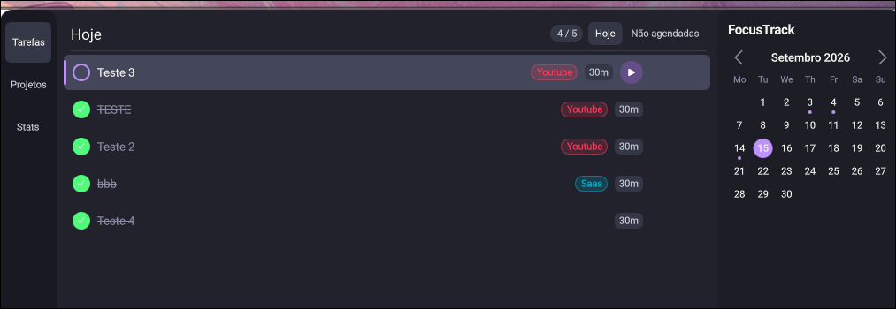
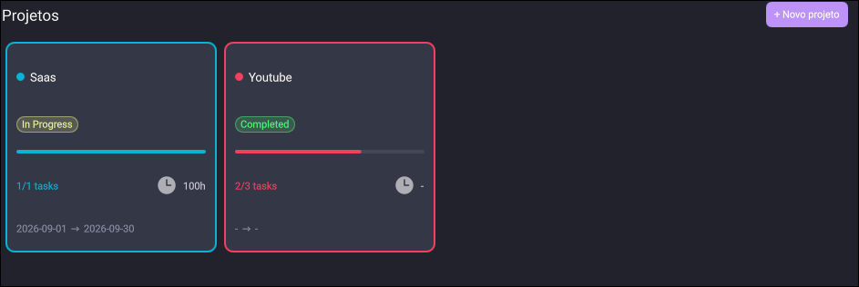
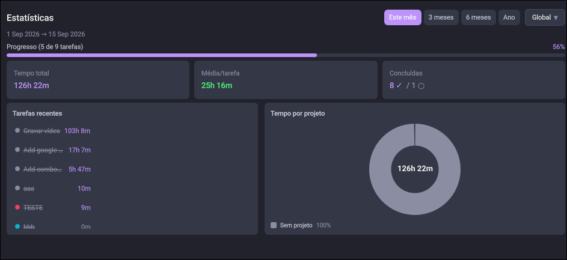
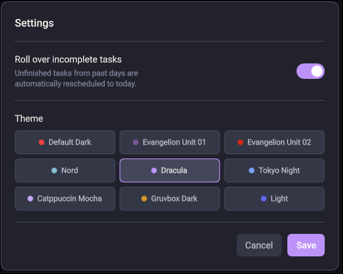

# focus-notch

A focus tracker that lives in your Wayland bar. Built with Rust + [Quickshell](https://quickshell.outfoxxed.me/).

Track tasks, projects and focused time without leaving your workflow — click the badge in your bar, pick a task, and go.

---

## Screenshots

| Bar badge | Task list |
|-----------|-----------|
|  |  |

| Projects | Statistics |
|----------|------------|
|  |  |



---

## Features

- **Bar badge** — always-visible pill showing active task, elapsed time and a progress trail. Click to play/pause.
- **Hover panel** — hover the badge to see today's tasks without opening the full window.
- **Task manager** — add, edit, complete and delete tasks. Schedule by date or leave unscheduled.
- **Projects** — group tasks into color-coded projects with status, description and date range.
- **Statistics** — time spent per project or per task, completion progress and recent activity. Filter by this month, 3 months, 6 months or year.
- **Activity heatmap** — GitHub-style calendar showing focus history.
- **Themes** — 9 built-in themes (Dark, Nord, Dracula, Tokyo Night, Catppuccin Mocha, Gruvbox, Evangelion Unit-01/02, Light). Swap at runtime from settings.

---

## Requirements

- Linux with a Wayland compositor (Hyprland, Sway, etc.)
- [Quickshell](https://quickshell.outfoxxed.me/) — Qt-based shell toolkit
- Rust + Cargo (for building from source)

---

## Installation

### Option A — Generic Linux (any distro)

```bash
git clone https://github.com/z4nder/quickshell-task-manager
cd quickshell-task-manager
./install.sh
```

This will:
1. Build `focusctl` with `cargo build --release`
2. Install the binary to `~/.local/bin/focusctl`
3. Deploy QML components and icons to `~/.config/quickshell/`

Make sure `~/.local/bin` is in your `$PATH`.

Then add the widget to your Quickshell bar config:

```qml
// In your bar's QML file — import Quickshell.Io for IpcHandler
import Quickshell.Io

// Inside your bar's Row/layout:
FocusWidget { id: focusWidget; barWindow: root }

// Optional: keybind toggle — hides/shows the badge in the bar
IpcHandler {
    target: "focus"
    function toggle() { focusWidget.visible = !focusWidget.visible }
}
```

Then bind a key to toggle it (Hyprland example):

```
bind = $mainMod, T, exec, quickshell ipc --any-display call focus toggle
```

> **Note:** `--any-display` is required when Quickshell is launched by a compositor autostart,
> as the IPC display registration may differ from the calling shell's display.

### Option B — NixOS / home-manager (flake)

Add the flake input:

```nix
# flake.nix
inputs.quickshell-task-manager.url = "github:z4nder/quickshell-task-manager";
```

#### B.1 — Standalone (focus-notch is your entire Quickshell config)

Add the overlay and home-manager module:

```nix
# In your nixpkgs overlays list
quickshell-task-manager.overlays.default

# In home-manager sharedModules (or imports)
quickshell-task-manager.homeManagerModules.default
```

Enable in your home config:

```nix
programs.focus-notch.enable = true;
```

The module deploys `focusctl`, all QML components, icons and `themes.json` to `~/.config/quickshell/`. Launch with:

```bash
quickshell -p ~/.config/quickshell
```

#### B.2 — Embedded (you have an existing Quickshell bar)

> **Important:** QML resolves imports by the real (resolved) path of `shell.qml`, not the symlink.
> If your bar config and the focus-notch files live in separate Nix store paths, imports will fail.
> You must merge both into a single store path using `pkgs.runCommand`.

Pass the flake input to your NixOS module via `specialArgs`:

```nix
# flake.nix — in your mkHost / nixosSystem call
specialArgs = { ...; inherit quickshell-task-manager; };
```

Then in the module that manages your Quickshell config:

```nix
{ pkgs, quickshell-task-manager, ... }:
let
  quickshellConfig = pkgs.runCommand "quickshell-merged-config" {} ''
    mkdir $out
    cp -r ${./your-bar-config}/. $out/          # your shell.qml, Bar.qml, etc.
    cp -r ${quickshell-task-manager}/quickshell/config/. $out/  # focus-notch QML
  '';
in {
  home.packages = [ pkgs.focusctl ];            # from overlay
  home.file.".config/quickshell".source = quickshellConfig;
}
```

Add `FocusWidget` to your bar:

```qml
FocusWidget { barWindow: root }
```

> **Note — `cargoHash` mismatch:** if you get a hash mismatch error after updating the flake, run:
> ```bash
> nix build github:z4nder/quickshell-task-manager#focusctl 2>&1 | grep "got:"
> ```
> and open an issue with the output so `nix/package.nix` can be updated.

---

## Usage

Once installed, the widget appears in your bar. Basic workflow:

1. **Open** the full window by clicking the expand icon on the hover panel.
2. **Add a task** — type in the "Nova tarefa..." field and press Enter. Optionally set estimated minutes and assign a project.
3. **Start a session** — click the play button on any task. The bar badge starts counting.
4. **Pause / resume** — click the badge in the bar, or use the play/pause button in the task list.
5. **Done** — click the circle checkbox on the task. It fades out after 1 second (click again to cancel).

### CLI

All state is managed by `focusctl`. You can drive it directly:

```bash
# Tasks
focusctl task add "Write tests" --estimated-mins 45
focusctl task list --json
focusctl task done 3
focusctl task edit 3 --title "Write unit tests" --project-id 1

# Sessions
focusctl start 3
focusctl pause
focusctl resume
focusctl stop

# Projects
focusctl project add "Backend" --color "#4488ff" --status InProgress
focusctl project list --json
focusctl project edit 1 --status Completed

# Settings
focusctl settings set theme dracula
focusctl settings set roll_incomplete true
```

---

## Data

Tasks, projects, sessions and settings are stored in a single SQLite database at:

```
~/.local/share/focus/focus.db
```

No cloud, no accounts, no sync — your data stays local.

---

## Development

```bash
# Enter dev shell (Nix)
nix develop

# Build CLI
cargo build -p focusctl

# Run UI with live log tailing
./debugger.sh
```

See [CONTRIBUTING.md](CONTRIBUTING.md) for the full development guide — project structure, architecture overview, how to add views/commands, database inspection, log locations and QML gotchas.

---

## License

MIT
